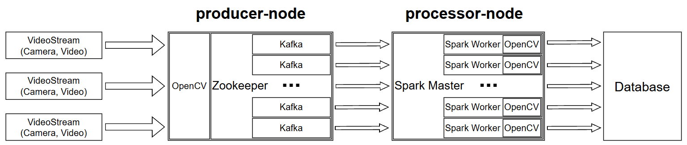

# Distributed Video Analytics System

## Overview

This is a distributed video analytics system built with Java, Apache Kafka, Apache Spark, and OpenCV. It is designed to process live video streams in real-time and detect motion.

The system consists of two main modules:

- **producer-node** – reads video frames using OpenCV, encodes them, and sends to Kafka.
- **processor-node** – consumes frames from Kafka, processes them using Spark Structured Streaming, detects motion, and records performance metrics via Prometheus.

## Architecture


## Features

- Real-time frame streaming using Apache Kafka.
- JSON-based video frame serialization.
- Distributed video processing with Apache Spark.
- Motion detection using OpenCV.

## Technologies

| Technology / Library            | Version             | Purpose                                                                 |
|--------------------------------|---------------------|-------------------------------------------------------------------------|
| **Apache Kafka**               | 4.0.0               | Transmission of video frames between system components                 |
| **Apache Zookeeper**           | 3.8.4 (via Docker)  | Coordination of Kafka brokers                                          |
| **Apache Spark Core**          | 3.5.5               | Core infrastructure for data processing                                |
| **Apache Spark Streaming**     | 3.5.5               | Support for streaming data processing                                  |
| **Apache Spark SQL**           | 3.5.5               | Structured data handling and streaming                                 |
| **Spark SQL Kafka Connector**  | 3.5.5               | Integration of Kafka data into Spark Streaming                         |
| **OpenCV (Bytedeco)**          | 4.10.0-1.5.11       | Computer vision and motion detection                                   |
| **Jackson Databind**           | 2.15.2              | JSON serialization/deserialization of objects                          |
| **Jackson JSR310 Datatype**    | 2.15.2              | Serialization/deserialization of Java time types (e.g., `Instant`)     |
| **SLF4J API**                  | 2.0.17              | Logging abstraction                                                     |
| **Logback Classic**            | 1.5.18              | Concrete implementation for logging (with SLF4J)                        |

## Getting Started

### Requirements

- Java 17 (JDK)
- Apache Maven 3.9.9
- Docker Desktop
- VS Code
- Hadoop for Windows (required for Spark on Windows)

### Environment Setup (Windows)

Before running the project, make sure to configure the following system environment variables:

- JAVA_HOME → path to your JDK (e.g., C:\Program Files\Java\jdk-17)
- MAVEN_HOME → path to Maven (e.g., C:\Program Files\Apache\Maven)
- HADOOP_HOME → path to extracted Hadoop Winutils, e.g., C:\hadoop
- 
Add %JAVA_HOME%\bin, %MAVEN_HOME%\bin, and %HADOOP_HOME%\bin to your system PATH.

If your project is located on the system drive (e.g., C:\), you must run Visual Studio Code as Administrator, or Spark may fail to access temp directories.

### Special JVM Arguments for Spark on Windows

When running or debugging processor-node (Spark) in VS Code, add the following VM argument in your launch configuration:
```json
"vmArgs": "--add-exports java.base/sun.nio.ch=ALL-UNNAMED"
```
Without this, Spark may throw access errors when initializing streaming context.

### Setup and Running on Windows in VS Code

1. Clone the repository:
```bash
git clone https://github.com/artmkchmv/CVDS.git
```
2. Open the project in Visual Studio Code and launch Kafka, Zookeeper, Spark Master and Spark Worker containers via Docker Compose:
```bash
cd cvds
docker-compose up -d
```
3. Build all modules:
```bash
mvn clean install
```
4. Specify the path to the video stream (camera or video file) in the `producer.properties` file:
```properties
camera.id=cam1
camera.url=cvds/videos/sample.mp4
```
5. Run VideoProcessor.java.
6. Run VideoProducer.java.
